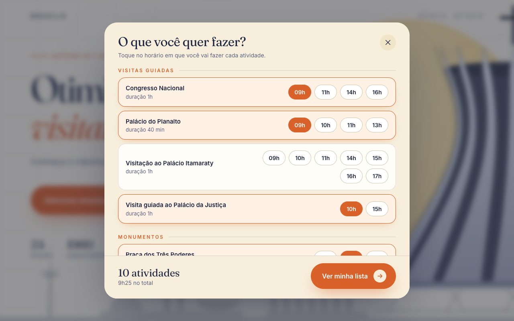
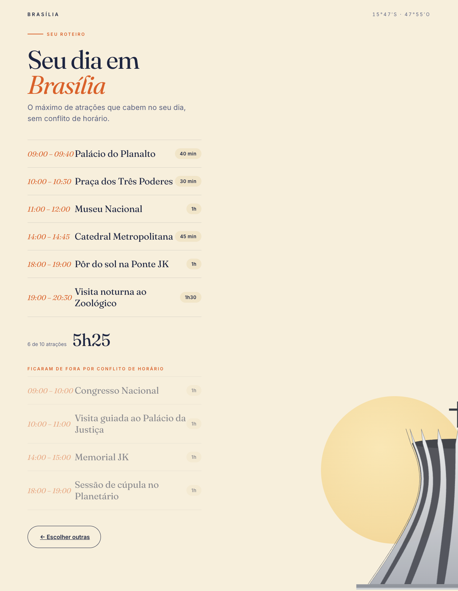

# Brasília em um dia

## Sobre o projeto

Este projeto aplica o algoritmo guloso **Interval Scheduling**, visto em aula, a um problema prático: montar um roteiro de um dia em Brasília.

O usuário seleciona as atrações que deseja visitar e o horário de cada uma. Como alguns horários se sobrepõem, o algoritmo escolhe o maior número de atrações que podem ser feitas sem conflito e indica quais ficaram de fora.

## Alunos

| Nome | Matrícula |
| --- | --- |
| ISABELLE DA COSTA FIGUEIREDO| 211039500 |


## Vídeo de apresentação

[▶️ Assistir no YouTube](https://youtu.be/1u6ij9rohTg?feature=shared)

## Arquivos do projeto

| Arquivo | Tipo | Para que serve |
| --- | --- | --- |
| `interval-scheduling.js` | **Algoritmo** | Implementação do Interval Scheduling. |
| `atracoes.js` | Dados | Lista das atrações (nome, horários possíveis e duração)|
| `index.html` | Front-end | Página inicial e tela de escolha das atrações e horários |
| `lista.html` | Front-end | Página do resultado: chama o algoritmo e mostra o roteiro |
| `style.css` | Estilo | Visual do site (cores, fontes e layout).  |
| `catedral.js` | Estilo | Só desenha a Catedral que aparece no fundo das páginas. Não tem lógica. |
| `docs/` | Documentação | Imagens usadas no README |

## Como funciona

É um site estático, feito só com **HTML, CSS e JavaScript puro**. Não usa framework nem banco de dados e não precisa de instalação nem de build. Tudo roda no navegador.

1. **Dados:** as atrações ficam em um array no `atracoes.js`. Cada uma tem nome, grupo, horários possíveis e duração em minutos.
2. **Seleção:** o `index.html` monta a lista na tela a partir desse array. Quando a pessoa clica em um horário, a escolha fica guardada.
3. **Passagem de dados:** ao clicar em "Ver minha lista", as escolhas são salvas no `sessionStorage` do navegador (uma memória temporária da aba), e a página muda para `lista.html`.
4. **Algoritmo:** o `lista.html` lê as escolhas, converte cada horário para minutos (por exemplo, 09:30 → 570) e chama a função `intervalScheduling`.
5. **Resultado:** a página mostra o roteiro final em ordem de horário, o tempo total e as atrações que ficaram de fora.

## Por que Interval Scheduling?

O problema do projeto é exatamente o do **Interval Scheduling**:

- cada atração é um **intervalo de tempo** (início e fim);
- existe **um único recurso**, a pessoa, que não pode estar em dois lugares ao mesmo tempo;
- o objetivo é escolher o **maior número de intervalos que não se sobrepõem**.

O intervalue scheduling sempre escolher a atração que **termina mais cedo**, porque ela libera o dia mais rápido para as próximas.

1. Ordenar as atrações pelo horário de término.
2. Percorrer a lista: se a atração começa depois que a última escolhida terminou, ela entra; senão, fica de fora.

Esse critério garante a **solução ótima**, ou seja, nenhum outro roteiro tem mais atrações. A complexidade é **O(n log n)**, por causa da ordenação.

## Telas

### 1. Página inicial
Apresenta o projeto. O botão "Selecionar atrações que tenho interesse" abre a janela de escolha.


### 2. Escolha de atrações e horários
As atrações aparecem separadas por grupo. A pessoa toca no horário em que quer fazer cada uma (tocar de novo desmarca). O rodapé mostra quantas foram escolhidas e o tempo somado.



### 3. Roteiro final
Resultado do Interval Scheduling. No topo fica o roteiro, em ordem de horário, com o total ("6 de 10 atrações"). Embaixo, apagadas, aparecem as atrações que ficaram de fora por conflito de horário.



## Como rodar localmente

Não precisa instalar nada. Basta clonar o repositório:

```bash
git clone https://github.com/projeto-de-algoritmos-2026/G39_Greed_PA-26.2.git
```

**Opção 1:** abrir o arquivo `index.html` direto no navegador (dois cliques).

**Opção 2:** rodar um servidor local com Python, dentro da pasta do projeto:

```bash
python3 -m http.server 8000
```

Depois, é só acessar http://localhost:8000 no navegador.

## Como usar

1. Na página inicial, clique em **"Selecionar atrações que tenho interesse"**.
2. Para cada atração que quiser fazer, toque no **horário** desejado.
3. Clique em **"Ver minha lista"**.
4. Veja o seu roteiro com o máximo de atrações possível e quais ficaram de fora.
5. Para mudar algo, clique em **"← Escolher outras"**. As escolhas anteriores continuam marcadas.
